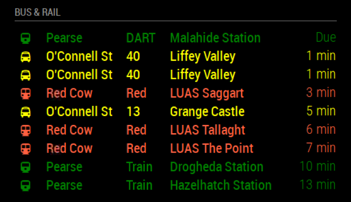
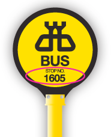
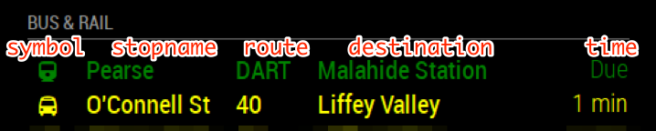

# MagicMirror Module: DublinRTPI
`MMM-DublinRTPI` (**R**eal-**T**ime **P**assenger **I**nformation) is a module for the [MagicMirror](https://github.com/MichMich/MagicMirror). It displays real-time arrival times for Dublin Bus, IrishRail and LUAS stops. The data is sourced via the [Dublinked RTPI](https://data.dublinked.ie/dataset/real-time-passenger-information-rtpi-for-dublin-bus-bus-eireann-luas-and-irish-rail) API.

This module is based on the [default `Calendar`](https://github.com/MichMich/MagicMirror/tree/master/modules/default/calendar) module, allowing it to display and be configured in a similar way.



# Usage
## Installation
### 1. Clone this module into your MagicMirror's `modules` directory
```bash
MagicMirror$  cd modules
modules$      git clone https://github.com/galaktor/MMM-DublinRTPI
```

### 2. Install this module's dependencies
```bash
modules$         cd MMM-DublinRTPI
MMM-DublinRTPI$  npm install
```

### 3. Add this module to your MM config's `modules` array
```bash
MMM-DublinRTPI$  cd ../..
MagicMirror$     nano config/config.js
```

Configure as described below and restart your MagicMirror.

## A typical configuration example
```javascript
/* MagicMirror/config/config.js */
{
  /* ...your other config here */

  modules: [

    /* ...your other modules here */

    { module: "MMM-DublinRTPI",
      position: "top_left",
      header: "Bus & Rail",
      config: { colored: true,
                stops: [{ id: "270",   label: "O'Connell", color: "yellow", directions: ["in"], routes: ["40"] },
                        { id: "PERSE", label: "Pearse",    color: "green",  directions: ["north"] },
                        { id: "LUAS6", label: "Red Cow",   color: "tomato", directions: ["south"] }]
      }
    }
  ]
}
```

## The full configuration explained
```javascript
/* MagicMirror/config/config.js */
{
  modules: [
    {
      module: "MMM-DublinRTPI",

      /* the usual MM module settings */
      position: "top_left"
      header: "Bus & Rail",

      /* configure this module */
      config: {

        /* the bus stops to show events for.
         * this is the most important part of the configuration.
         * TYPE: array of objects
         * REQUIRED: no (but it won't be very useful if left empty)
         * DEFAULT: [] (empty) */
        stops: [
            {
                /* ID of the bus, luas or rail stop to show events for.
                 * see below for details on finding the right stop IDs.
                 * TYPE: string
                 * REQUIRED: yes */
                id: "123",

                /* a friendly name to display instead of the stop ID.
                 * because the stop ID often isn't very meaningful.
                 * TYPE: string
                 * REQUIRED: no
                 * DEFAULT: the stop ID */
                label: "O'Connell St",

                /* select which routes to show events for at this stop.
                 * routes which don't match any of these strings EXACTLY
                 * will not be displayed. letters are not case-sensitive.
                 * if left empty, will show all routes at the stop.
                 * TYPE: array of strings
                 * REQUIRED: no
                 * DEFAULT: [] (empty) */
                routes: ["123", "123x"],

                /* select which directions to show events for at this stop.
                 * directions which don't CONTAIN any of these strings
                 * will not be displayed. letters are not case-sensitive.
                 * the value you can use here depends on the service.
                 * typically they are one of:
                 * -  "northbound" or "southbound" for luas and rail
                 * -  "inbound" or "outbound" for bus
                 * if left empty, will show all directions at the stop.
                 * NOTE: "out" is contained in "southbound" as well as "outbound".
                 * TYPE: array of strings
                 * REQUIRED: no
                 * DEFAULT: [] (empty) */
                directions: ["northbound", "inbound"],

                /* select which destinations to show events for at this stop.
                 * destinations which don't CONTAIN any of these strings
                 * will not be displayed. letters are not case-sensitive.
                 * the value you can use here depends on the route.
                 * if left empty, will show all directions at the stop.
                 * NOTE: "Connolly" is contained in "Dublin Connolly" as well as "LUAS Connolly".
                 * TYPE: array of strings
                 * REQUIRED: no
                 * DEFAULT: [] (empty) */
                destinations: ["UCD", "Connolly"],

                /* the FontAwesome symbol to use for events at this stop.
                 * TYPE: string (see https://fontawesome.com/icons)
                 * REQUIRED: no
                 * DEFAULT: autodetect based on the stop ID
                 * - "bus" for Dublin Bus stops
                 * - "train" for Irish Rail stops
                 * - "subway" for Luas stops */
                symbol: "beer",

                /* the color to use for events at this stop.
                 * requires the module option 'colored' to be 'true'
                 * TYPE: string (CSS values, see https://www.w3schools.com/colors/colors_names.asp)
                 * REQUIRED: no
                 * DEFAULT: magic mirror default text color */
                color: "pink",

                /* maximum number of events to display for this stop.
                 * TYPE: uint
                 * REQUIRED: no
                 * DEFAULT: value of module config */
                maximumEntries: 123,

                 /* hide events with a duetime greater than this.
                  * TYPE: uint (minutes)
                  * REQUIRED: no
                  * DEFAULT: value of module config */
                maximumNumberOfMinutes: 60,
            },
            /* configure more stops if you wish to */
        ],


        /* choose specific routes to be displayed for stops which
         * don't have routes explicitly defined. per-stop config
         * takes preference. see stop config above for more details.
         * TYPE: array of strings
         * REQUIRED: no
         * DEFAULT: [] (empty) */
         routes: ["123", "123x"],

        /* choose specific directions to be displayed for stops which
         * don't have directions explicitly defined. per-stop config
         * takes preference. see stop config above for more details.
         * TYPE: array of strings
         * REQUIRED: no
         * DEFAULT: [] (empty) */
         directions: ["northbound", "inbound"],

        /* choose specific directions to be displayed for stops which
         * don't have directions explicitly defined. per-stop config
         * takes preference. see stop config above for more details.
         * TYPE: array of strings
         * REQUIRED: no
         * DEFAULT: [] (empty) */
         destinations: ["UCD", "Connolly"],

        /* maximum number of events to display IN TOTAL.
         * TYPE: uint
         * REQUIRED: no
         * DEFAULT: 10 */
        maximumEntries: 10,

        /* hide events with a duetime later than this.
         * TYPE: uint (minutes)
         * REQUIRED: no
         * DEFAULT: 60 */
        maximumNumberOfMinutes: 60,

        /* display a symbol for each event.
         * TYPE: boolean
         * REQUIRED: no
         * DEFAULT: true */
        displaySymbol: true,

        /* display the bus stop name.
         * TYPE: boolean
         * REQUIRED: no
         * DEFAULT: true */
        displayStopName: true,

        /* display the bus route.
         * TYPE: boolean
         * REQUIRED: no
         * DEFAULT: true */
        displayRoute: true,

        /* display the destination of each event.
         * TYPE: boolean
         * REQUIRED: no
         * DEFAULT: true */
        displayDestination: true,

        /* how long to wait before fetching new data.
         * TYPE: uint (milliseconds)
         * REQUIRED: no
         * DEFAULT: 60000 (1 minute) */
        fetchInterval: 60000,

        /* the time an update animation takes.
         * TYPE: uint (milliseconds)
         * REQUIRED: no
         * DEFAULT: 2000 (2 seconds) */
        animationSpeed: 1000,

        /* gradually fade out events towards the bottom.
         * TYPE: boolean
         * REQUIRED: no
         * DEFAULT: true */
        fade: true,

        /* when to begin fading out events in the list.
         * value between 0 and 1, where 0 is the top and
         * 1 is the bottom of the list.
         * TYPE: float (0-1)
         * REQUIRED: no
         * DEFAULT: 0.25 */
        fadePoint: 0.25,

        /* use colors to display the events.
         * colors are individually set on the stops.
         * TYPE: boolean
         * REQUIRED: no
         * DEFAULT: false */
        colored: false,

        /* broadcast all the events to all other modules.
         * notification: `DUBLINBUS_EVENTS`
         * TYPE: boolean
         * REQUIRED: no
         * DEFAULT: true */
        broadcastEvents: true,
      }
    }
  ]

}
```

# Valid RTPI values
The values for `id`, `direction`, `destination`, and `route` depend on the service and stop you want to use. You will need to determine the right values by querying the RTPI database.

## Finding your stop ID
A full list of stops is available [via the RTPI API](https://data.dublinked.ie/cgi-bin/rtpi/busstopinformation). One can use [`curl`](https://curl.haxx.se/) and [`jq`](https://stedolan.github.io/jq/) to pull out stops, e.g.

### stops with `UCD` in the name and which are served by route `67X`
```bash
curl https://data.dublinked.ie/cgi-bin/rtpi/busstopinformation | \
jq '.results[] |
    select(.fullname | contains("UCD")) |
    select(.operators[].routes[]=="67X")'
```
```json
/* response */
{
  "stopid": "4952", /* <-- */
  "displaystopid": "4952",
  "shortname": "UCD",
  "shortnamelocalized": "UCD",
  "fullname": "UCD",
  "fullnamelocalized": "",
  "latitude": "53.30494889",
  "longitude": "-6.216826944",
  "lastupdated": "11/12/2017 10:09:21",
  "operators": [
    {
      "name": "bac",
      "routes": [
        "77X",
        "84X",
        "67X",
        "66X",
        "27X",
        "32X"
      ]
    }
  ]
}
```

### all stops for Luas green line
```bash
curl https://data.dublinked.ie/cgi-bin/rtpi/busstopinformation | \
jq '.results[] |
    select(.operators[].name=="LUAS") |
    select(.operators[].routes[]=="Green")'
```
```json
/* response */
{
  "stopid": "LUAS24", /* <-- */
  "displaystopid": "LUAS St. Stephen's Green",
  "shortname": "",
  "shortnamelocalized": "",
  "fullname": "LUAS St. Stephen's Green",
  "fullnamelocalized": "",
  "latitude": "53.33907222",
  "longitude": "-6.261333333",
  "lastupdated": "08/01/2018 09:29:30",
  "operators": [
    {
      "name": "LUAS",
      "routes": [
        "Green"
      ]
    }
  ]
}
/* ...and many more */
```

### Bus Stop signs
Dublin Bus stop ids can also be found on the physical bus stop signs:



The ID on this sign refers to [stop id 1605](https://data.dublinked.ie/cgi-bin/rtpi/busstopinformation?stopid=1605).

### Customisation
You can customize this module in many ways.
- combine several stops into a single MM module
- group stops into separate MM modules by service, stop, direction, etc.
- assign stops different colors and symbols via the `symbol` and `color` settings
- hide some or all parts of the displayed events via the `displaySymbol`, `displayStopName`, `displayRoute` and `displayDestination` settings
- further modify how the parts of an event are styles by editing the [`dublinrtpi.css`](./dublinrtpi.css) file directly

The naming used to describe the different parts of an event in the module are as follows:



# Kudos
This module is Loosely based on the [default Calendar module](https://github.com/MichMich/MagicMirror/tree/master/modules/default/calendar) by [Michael Teeuw](http://michaelteeuw.nl). Shout-out to [dr4ke616/MMM-Dublin-Bus](https://github.com/dr4ke616/MMM-Dublin-Bus), which showed me how to query the RTPI API.
